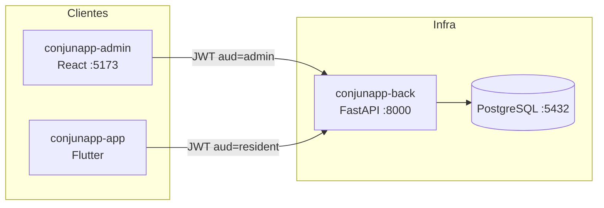
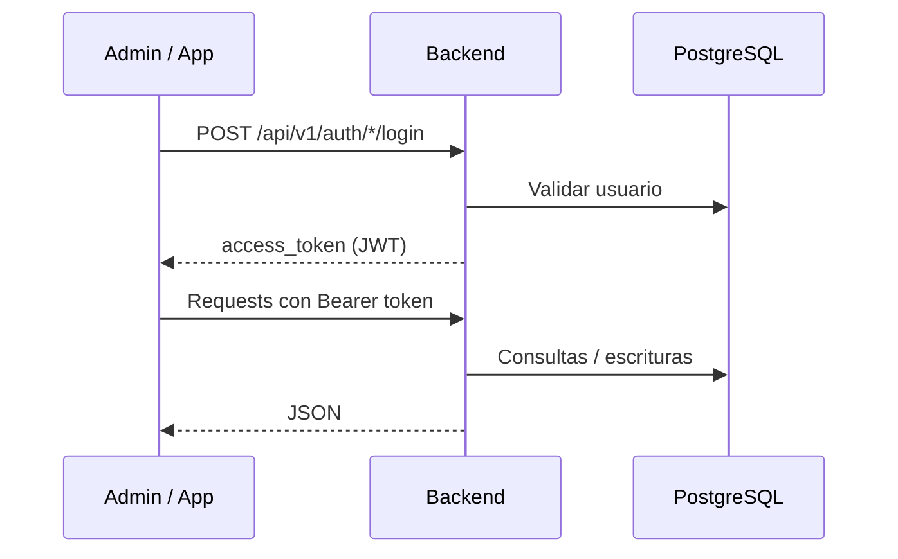

# ConjunApp

Plataforma integral para la administración de conjuntos residenciales.

Permite a la administración gestionar unidades, residentes, cartera y comunicados; y a los residentes autenticarse, consultar información y (en evolución) gestionar reservas, pagos e invitados.

## Repositorios

| Repositorio | Rol | Stack |
|-------------|-----|-------|
| [`conjunapp-back`](./conjunapp-back) | API REST | Python 3.12, FastAPI, SQLAlchemy, PostgreSQL |
| [`conjunapp-admin`](./conjunapp-admin) | Panel web de administración | React 19, Vite 6, TypeScript, Zustand |
| [`conjunapp-app`](./conjunapp-app) | App de residentes | Flutter / Dart, Provider |

> **Nota:** El stack real es FastAPI + React + Flutter. No usa NestJS ni Angular.

## Arquitectura de alto nivel



## Clonar el monorepo

Este repositorio usa **git submodules** para `conjunapp-back`, `conjunapp-admin` y `conjunapp-app`.

```bash
git clone --recurse-submodules git@github.com:Jonathan-Correa/Conjuntos.git
cd Conjuntos
```

Si ya clonaste sin submódulos:

```bash
git submodule update --init --recursive
```

## Inicio rápido con Docker

Requisitos: [Docker](https://docs.docker.com/get-docker/) y Docker Compose v2.

```bash
# Desde la raíz del monorepo
cp .env.example .env
docker compose up --build
```

Servicios:

| Servicio | URL |
|----------|-----|
| API + Swagger | http://localhost:8000/docs |
| Admin (Vite) | http://localhost:5173 |
| PostgreSQL | localhost:5432 |

Credenciales demo (seed automático al arrancar el backend):

| Rol | Email | Password |
|-----|-------|----------|
| Admin | `admin@conjunapp.com` | `admin123` |
| Residente | `ana@example.com` | `residente123` |

### Variantes Compose

```bash
docker compose -f docker-compose.yml -f docker-compose.dev.yml up --build
docker compose -f docker-compose.yml -f docker-compose.prod.yml up --build -d
```

Detalle en [`docs/Docker.md`](./docs/Docker.md).

## App Flutter (fuera de Compose)

La app móvil/desktop se ejecuta con el SDK de Flutter:

```bash
cd conjunapp-app
flutter pub get
flutter run --dart-define=API_BASE_URL=http://10.0.2.2:8000/api/v1
```

En emulador Android usa `10.0.2.2`; en iOS/sim o dispositivo de la misma red, la IP del host.

## Documentación

Toda la documentación vive en [`/docs`](./docs):

| Documento | Contenido |
|-----------|-----------|
| [Arquitectura](./docs/Arquitectura.md) | Visión del sistema |
| [Backend](./docs/Backend.md) | API FastAPI |
| [Admin](./docs/Admin.md) | Panel React |
| [App](./docs/App.md) | App Flutter |
| [Docker](./docs/Docker.md) | Contenedores |
| [Base de datos](./docs/BaseDatos.md) | Modelo de datos |
| [Variables de entorno](./docs/VariablesEntorno.md) | Env documentadas |
| [Flujo de autenticación](./docs/FlujoAutenticacion.md) | JWT admin/residente |
| [Roadmap](./docs/Roadmap.md) | Evolución del producto |
| [Pendientes](./docs/Pendientes.md) | Trabajo abierto |
| [Decisiones de arquitectura](./docs/DecisionesArquitectura.md) | ADRs y recomendaciones |
| [Deuda técnica](./docs/DeudaTecnica.md) | Hallazgos de calidad |

Estándares permanentes del agente/equipo: [`AGENTS.md`](./AGENTS.md).

## Flujo entre proyectos



1. Admin y App hablan solo con el backend (`/api/v1`).
2. El backend autentica con JWT (`aud=admin` o `aud=resident`).
3. PostgreSQL es el único almacén persistente.
4. El seed carga un conjunto demo la primera vez.

## Desarrollo local (sin Docker para frontends)

Ver READMEs de cada repositorio. Orden típico:

1. Levantar PostgreSQL (Compose solo `db`, o local).
2. Arrancar `conjunapp-back`.
3. Arrancar `conjunapp-admin` y/o `conjunapp-app`.
