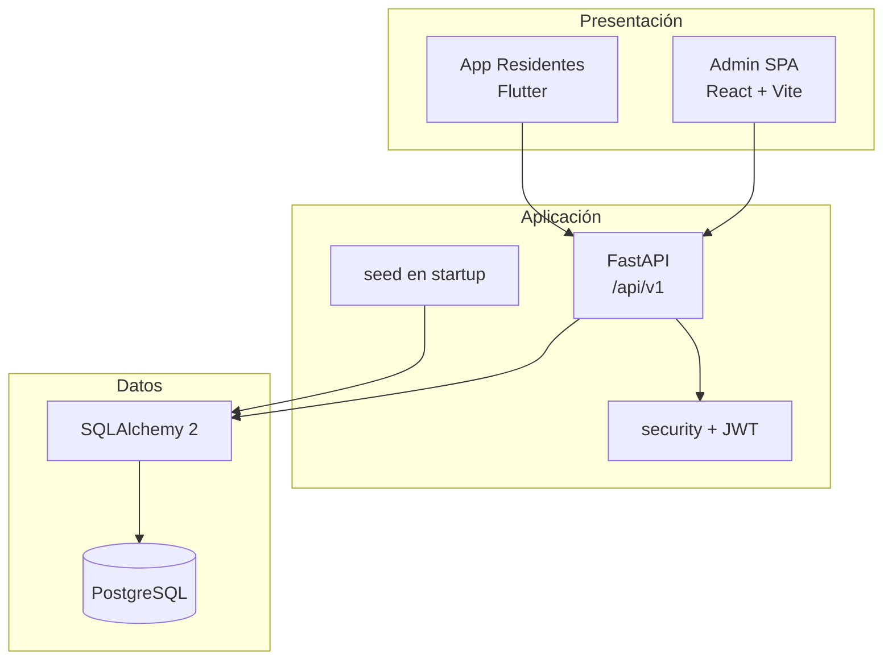

# Arquitectura — ConjunApp

## Visión

ConjunApp es un sistema monolítico en capas con tres clientes de producto:

1. **Backend** (`conjunapp-back`): API REST única (FastAPI).
2. **Admin** (`conjunapp-admin`): SPA para administración.
3. **App** (`conjunapp-app`): cliente Flutter para residentes.

Hoy no hay API Gateway, microservicios, cache ni colas. La comunicación es HTTP directo + JWT.

## Diagrama de componentes

## Capas del backend

| Capa | Ubicación | Responsabilidad |
|------|-----------|-----------------|
| Entrada | `app/main.py` | App factory, CORS, startup |
| API | `app/api/routes.py`, `auth.py` | Endpoints y guards |
| Dominio/persistencia | `app/models/domain.py` | Modelos ORM |
| Contratos | `app/schemas/domain.py` | DTOs Pydantic |
| Infra | `app/db/session.py`, `app/core/*` | DB y settings |
| Bootstrap | `app/services/seed.py` | Datos demo |

## Capas del admin

UI (pages) → store Zustand → `lib/api.ts` → backend.

## Capas de la app

Screens → `AuthProvider` / services → `ApiClient` → backend.

## Decisiones actuales

- Un solo backend para admin y residentes (audiencias JWT distintas).
- Schema creado con `create_all` (sin Alembic todavía).
- Seed idempotente por existencia de `ResidentialComplex`.
- CORS orientado a Vite (`localhost:5173`).

## Arquitectura futura (no implementada)

Ver [DecisionesArquitectura.md](./DecisionesArquitectura.md): modularización del monolito, Alembic, gateway, cache, colas, observabilidad y posibles microservicios cuando el dominio lo justifique.
