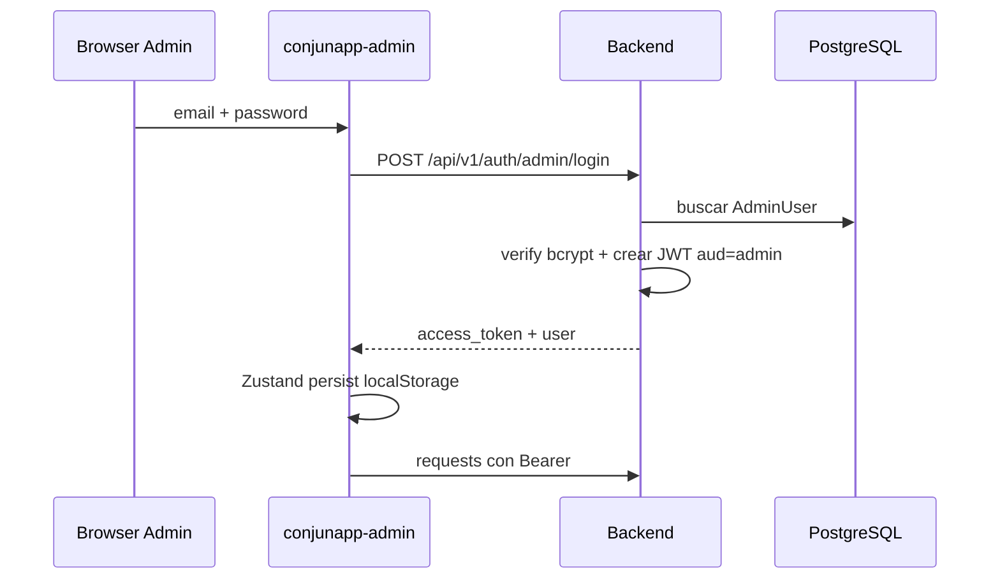
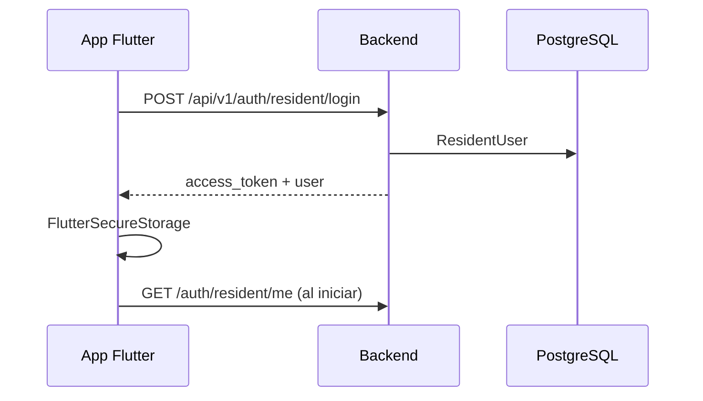

# Flujo de autenticación — ConjunApp

## Modelo

Dos audiencias JWT independientes:

| Audiencia (`aud`) | Tabla | Cliente |
|-------------------|-------|---------|
| `admin` | `admin_users` | conjunapp-admin |
| `resident` | `resident_users` | conjunapp-app |

Algoritmo: HS256. Header: `Authorization: Bearer <token>`.

## Login admin

## Login residente

## Guards

- `get_current_admin`: valida JWT `aud=admin` y usuario activo.
- `get_current_resident`: valida JWT `aud=resident` y usuario activo.
- Flag `is_super_admin` existe en modelo pero **aún no se usa** en endpoints.

## Registro

| Endpoint | Estado | Control |
|----------|--------|---------|
| `POST /auth/admin/register` | Condicional | Requiere `ALLOW_ADMIN_REGISTER=true` |
| `POST /auth/resident/register` | Público | Requiere torre/unidad existentes |
| `POST /admin/residents` | Admin | Password vía `initial_password` (mín. 8) |

En `docker-compose.prod.yml`, `ALLOW_ADMIN_REGISTER` y `SEED_ON_STARTUP` default a `false`. Con `ENVIRONMENT=production` el API no arranca con JWT/DB inseguros.

## Almacenamiento cliente

| Cliente | Storage | Clave |
|---------|---------|-------|
| Admin | localStorage (Zustand persist) | `auth-store` |
| App | flutter_secure_storage | token + user JSON |

## Gaps conocidos

- Sin refresh tokens (la app borra `refresh_token` nunca guardado).
- Admin no revalida `/auth/admin/me` al cargar; solo mira flag local.
- Secret por defecto inseguro si no se configura `.env`.
- Expiración larga (12 h) por defecto.
